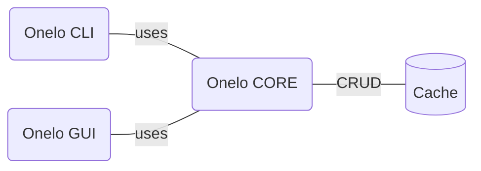

# What's Onelo

Onelo is a __set of tools__ that given a __data source__, __find files__ and __inspect their content__ to __extract structures__ that can be __exported__ and later __displayed__.

## Data sources

In the early stages of development, we understand data sources as some directory on the local file system. Future versions could be able to use remote data sources like Dropbox, Github repositories, etc accessed via API.

## Find files

Search all files in the data source including subdirectories.

## Inspect content

Read the content of a given file and store it.

We persists the content read in a cache to improve the performance of future actions carried out with this content.

## Extract structures

From all the files found and inspected, three types of structures can be extracted:

1. __Explicit__: The same file hierarchy we can find in the data source filesystem.
2. __Implicit__: The structure is created based on:
    * links between files written in the content
    * some [metadata](file-metadata.md) specified in the file and understandable by Onelo
3. __Inferred__: The structure is created based on some machine learning or natural language processing algorithms

## Export structures

Structures could be represented in several ways that fit the needs of each structure, for example, an implicit structure could be represented as a graph or an inferred structure could be represented as some non-linear stuff.

In the end, a representation should be:

* Exported as some set of data that can be consumed
* Persisted as a file (using the best approach, for example, [mermaid](https://mermaid-js.github.io) or [dot](https://en.wikipedia.org/wiki/DOT_(graph_description_language)), etc)

## Display structures and content

A structure exported (as a stream of data or as a file) could be displayed using different representations depending on the nature of the structure (some kind of graph, a classic hierarchy, etc). Moreover, it can be navigated and should display the content inspected.

The user could swap between the differents structures extracted (if there are more than one).

## Tools

We have saved the tools for last. Tools are the things we need to accomplish the things explained in the previous sections.

* [__Onelo Core__](onelo-core.md): It is a library that exposes a set of functionalities necessary to search for files, inspect their content, extract structures and export them
* [__Onelo CLI__](onelo-cli.md): It is a way to use the functionalities exposed by Onelo Core using the command line
* [__Onelo GUI__](onelo-gui.md): It is a way to use the functionalities exposed by Onelo Core using a graphic interface

